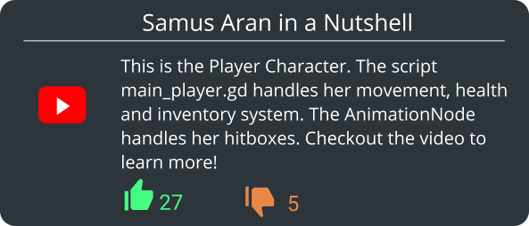
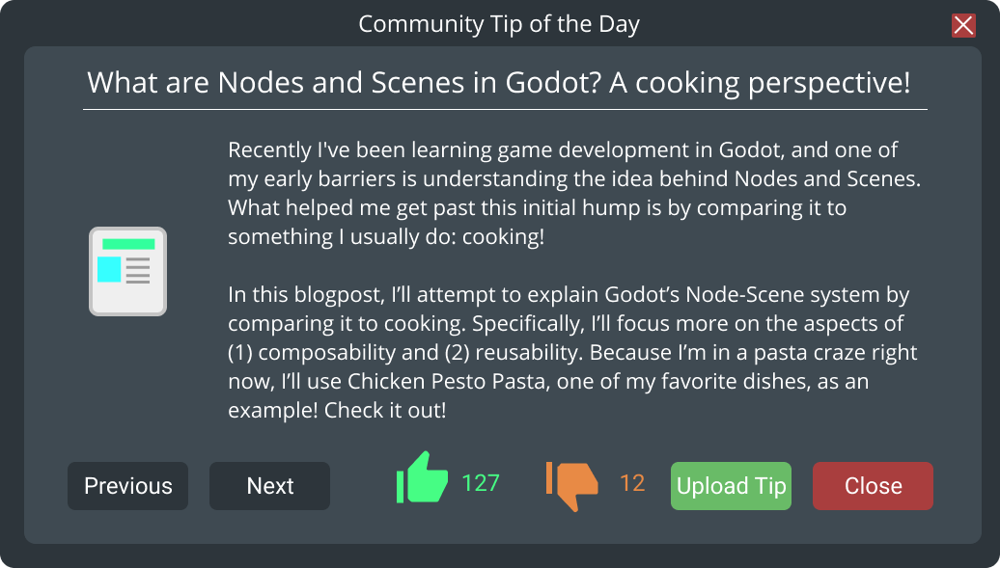

# CrowdbasedHelpFacilites

# Abstract
This repository explores Crowdbased Help Facilites in the Godot Engine. More concrete I explore 2 ideas: An Enhanced Tool-Tip and a Crowdbased Tip of the Day (ToD).

# Enhanced Tool-Tip
A Tool-Tip normally consists of a short description of a item the user is hovering over. I enhance the Tool-Tip to reference additional information, like a blogpost or a video, as well as a rating system to further manage and improve the tool.

Here is a UI Mockup.

 
*Mockup of the Enhanced Tool-Tip with Color*

# Crowdbased Tip of the Day (ToD)
A ToD is typically a Pop-Up window displayed when the software starts. It contains a tip for the user, explaining an advanced feature to improve the understanding of the software. I extend the ToD to support the involvement of the crowd, enabling them to commit their own tip and ratetips of others, as well as the recommendation of tips.

 
*Mockup of the Crowdbased Tip of the Day with Color*
